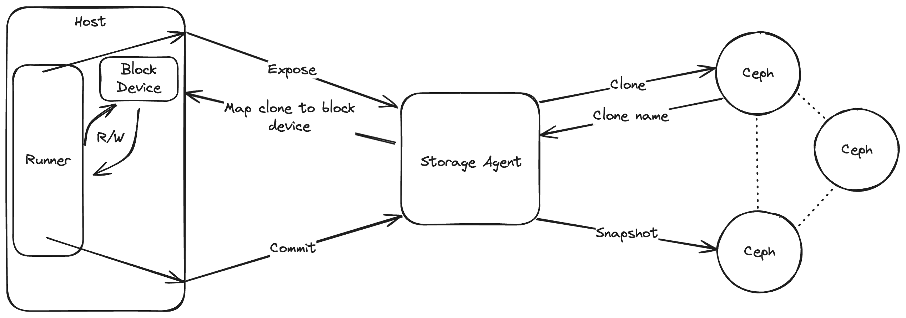

<p align="center">
  <picture>
    <!-- Dark mode -->
    <source media="(prefers-color-scheme: dark)" srcset="./Blacksmith_Logo-White-Large.png" width="300">
    <!-- Light mode -->
    <source media="(prefers-color-scheme: light)" srcset="./Blacksmith_Logo-Black-Large.png" width="300">
    
  </picture>
</p>

A GitHub Action that helps persist state written to disk across jobs. This action can serve as a superior alternative to the [Actions cache](https://github.com/useblacksmith/cache), especially when the cache artifacts are extremely large. Each sticky disk is hot-loaded into the runner and mounted at the specified path.
The sticky disk is formatted as an ext4 filesystem.

> [!CAUTION]
> Alpha: This GitHub Action is currently in Alpha. There may be bugs, and the inputs/outputs and overall behavior may change without notice.

# Architecture

<p align="center">
  <picture>
    <!-- Dark mode -->
    <source media="(prefers-color-scheme: dark)" srcset="./arch-dark-mode.png" width="1000">
    <!-- Light mode -->
    <source media="(prefers-color-scheme: light)" srcset="./arch-light.png" width="1000">
    
  </picture>
</p>

Blacksmith stores sticky disk artifacts in a secure, highly performant Ceph cluster, running on local NVMe drives. Our runners proxy their requests through our Storage Agents to interact with the Ceph cluster. Each sticky disk is uniquely identified by a key. When a GitHub Action job requests a sticky disk, the last committed snapshot will be cloned and mounted into the runner at the specified path. Once the job completes, the sticky disk will be unmounted and committed for future invocations. At the moment, customers can use up to 5 sticky disks in a single GitHub Action job.

# Use Cases

## NPM Package Caching

Node.js projects can have extensive dependency trees, leading to large `node_modules` directories. Sticky disks provide persistent, high-performance storage for your NPM packages.

```yaml
jobs:
  build:
    runs-on: blacksmith
    steps:
      - uses: actions/checkout@v4

      - name: Setup Node.js
        uses: useblacksmith/setup-node@v5
        with:
          node-version: "18.x"

      - name: Mount NPM Cache
        uses: useblacksmith/stickydisk@v1
        with:
          key: ${{ github.repository }}-npm-cache
          path: ~/.npm

      - name: Mount node_modules
        uses: useblacksmith/stickydisk@v1
        with:
          key: ${{ github.repository }}-node-modules
          path: ./node_modules

      - name: Install Dependencies
        run: npm ci

      - name: Build
        run: npm run build
```

## Bazel Build Caching

Bazel's remote cache can significantly improve build times, but uploading and downloading cached artifacts can still be a bottleneck. Using sticky disks with Blacksmith runners provides near-instant access to your Bazel caches as they are bind mounted into your runners on demand. Our [`useblacksmith/setup-bazel@v2`](https://github.com/useblacksmith/setup-bazel) action is a zero-confg way to use sticky disks to store the disk, repository, and external cache.

```yaml
jobs:
  build:
    runs-on: blacksmith
    steps:
      - uses: actions/checkout@v4

      - name: Setup Bazel
        uses: useblacksmith/setup-bazel@v2
        with:
          version: "6.x"

      - name: Build
        run: |
          bazel build //...
```

### Cache Performance Comparison

| Caching Solution     | Cache Size | Average Download Speed | Time to Access |
| -------------------- | ---------- | ---------------------- | -------------- |
| GitHub Actions Cache | 6GB        | 90 MB/s                | ~1m6s          |
| Blacksmith Cache     | 6GB        | 400 MB/s               | ~15s           |
| Sticky Disks         | 6GB        | N/A                    | 3 seconds      |

# useblacksmith/stickydisk-delete

[useblacksmith/stickydisk-delete](https://github.com/useblacksmith/stickydisk-delete) allows you to delete sticky disks programmatically. It supports two deletion methods:

## Delete by Key

Delete a specific sticky disk using its key:

```yaml
- name: Delete sticky disk
  uses: useblacksmith/stickydisk-delete@v1
  with:
    delete-key: my-cache-disk
```

## Delete Docker Cache

Delete Docker build cache for your repository. This should be used in conjunction with `useblacksmith/setup-docker-builder@v1`, which sets up the sticky disk for Docker build caching:

```yaml
- name: Delete Docker cache
  uses: useblacksmith/stickydisk-delete@v1
  with:
    delete-docker-cache: true
```

## Example: Cleanup After Build

```yaml
name: Build with Cleanup
on: push

jobs:
  build:
    runs-on: blacksmith-4vcpu-ubuntu-2204
    steps:
      - name: Create sticky disk for dependencies
        uses: useblacksmith/stickydisk@v1
        with:
          key: deps-cache
          path: ~/.npm

      - uses: actions/checkout@v4

      - name: Install and build
        run: |
          npm ci
          npm run build

  cleanup:
    runs-on: blacksmith-4vcpu-ubuntu-2204
    needs: build
    if: always()
    steps:
      - name: Delete sticky disk
        uses: useblacksmith/stickydisk-delete@v1
        with:
          delete-key: deps-cache
```
